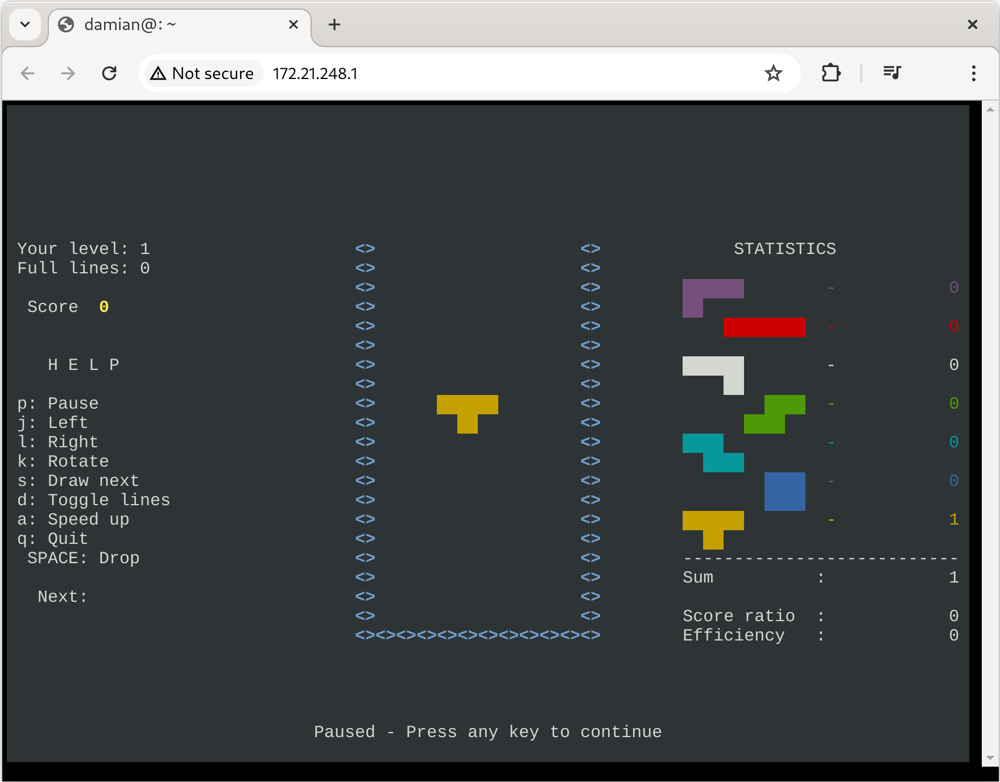

# nsh

The [Noisy Sockets](https://github.com/noisysockets/noisysockets) CLI.

The Noisy Sockets CLI can be used to configure and manage userspace WireGuard connections. Over time it will grow to include a collection of WireGuard powered apps.

The first of these apps is the [Noisy Sockets Shell](https://github.com/noisysockets/shell) which is a secure, remote shell that uses WireGuard for authentication and encryption. The shell is accessible via a terminal or a web browser.

## Screenshots


*Showing a terminal session using the in-browser client.*

## Getting Started

### Initialize Configuration

The `config init` command will generate a new private key and populate the
configuration file with the provided options.

```sh
nsh config init -c server.yaml -n server --listen-port=51820 --ip=172.21.248.1
nsh config init -c client.yaml -n client --listen-port=51821 --ip=172.21.248.2
```

### Add Peers

The server and client will need to be aware of each other in order to establish 
a connection. The `peer add` command will add a peer to the configuration file.

*Note: The client will need to know the servers endpoint in order to establish a connection.*

```sh
nsh peer add -c server.yaml \
  --name=client \
  --public-key=$(nsh config show -c client.yaml 'public(.privateKey)') \
  --ip=$(nsh config show -c client.yaml '.ips[0]')

nsh peer add -c client.yaml \
  --name=server \
  --public-key=$(nsh config show -c server.yaml 'public(.privateKey)') \
  --endpoint=$(nsh config show -c server.yaml '"localhost:" + (.listenPort|tostring)') \
  --ip=$(nsh config show -c server.yaml '.ips[0]')
```

### Start Server

In another tab, start the server.

```sh
nsh shell serve -c server.yaml
```

### Connect to Server

#### Using CLI

You can connect to the shell server by its hostname, or the IP address. In the 
following example, we will connect to the server using the hostname.

```sh
nsh shell connect -c client.yaml server
```

#### Using Browser

When using the wg kernel module, you will need t connect to the shell server
using the IP address (as we haven't yet implemented an integrated DNS resolver).

```sh
sudo nsh config export -c client.yaml -o /etc/wireguard/nsh0.conf
sudo wg-quick up nsh0

xdg-open http://172.21.248.1
```

## License

The Noisy Sockets CLI is licensed under the [Noisy Sockets Source License 1.0 (NSSL-1.0)](./LICENSE). NSSL-1.0 is a source-available license inspired by the [FSL-1.1](https://fsl.software/).

You are welcome to use the Noisy Sockets CLI for your own internal use, but developing a competing product is not permitted.

See [LICENSE](./LICENSE) for the full license text.

## Credits

Noisy Sockets is based on code originally from the [wireguard-go](https://git.zx2c4.com/wireguard-go) project by Jason A. Donenfeld.

WireGuard is a registered trademark of Jason A. Donenfeld.